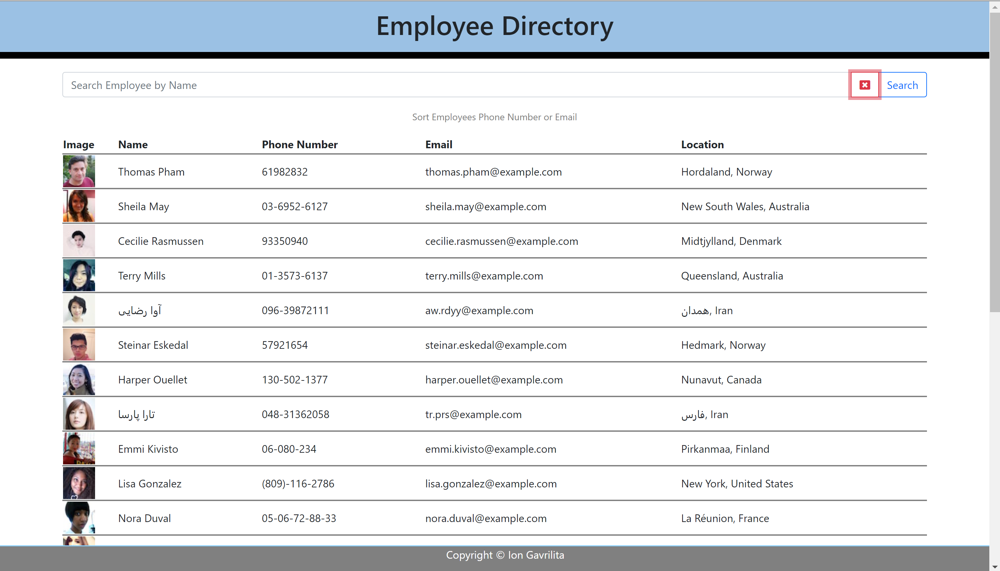
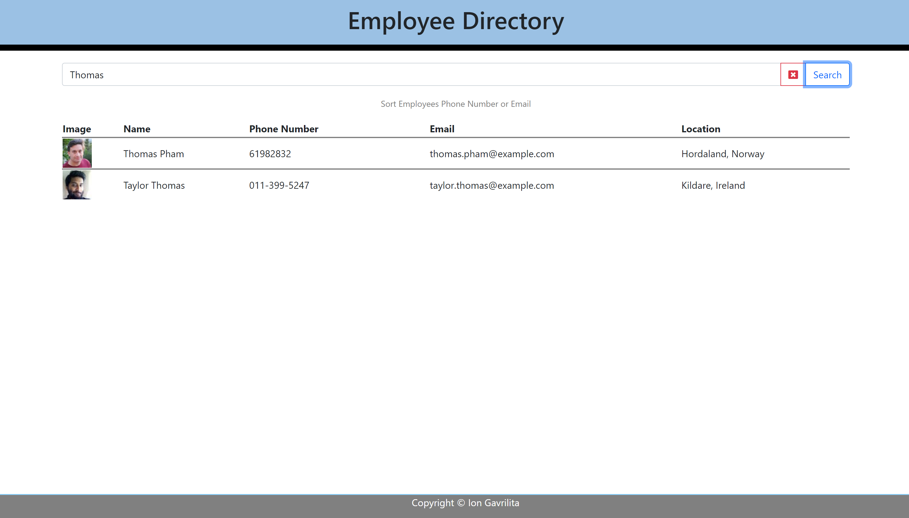

# Employee Directory
An employee or manager would benefit greatly from being able to view non-sensitive data about other employees. It would be particularly helpful to be able to filter employees by name. This App is build with React.

### Employee Directory contents:
* [User Story](#User-Story)
* [Images with application functionality](#Images-with-application-functionality)
* [Tech/framework used](#Tech/framework-used)
* [Installation](#Installation)
* [Project Link & Repository](#Project-Link-&-Repository)
* [Contributors](#Contributors)
* [License](#License)

### User Story
```
As a user, I want to be able to view my entire employee directory at once so that I have quick access to their information.

```
### Images with application functionality:

|  |  |

### Tech/framework used:
* Node JS
* React

### Installation  
* Copy repository on your local machine
* Create a `.gitignore` file and include `node_modules/`, `.DS_Store/` so that your `node_modules` isn't uploaded to GitHub. Be sure to create your `.gitignore` file before installing any npm dependencies.
* Run npm install  in your terminal to install all dependency
* Run npm start - to start the app
* 

### Project Link & Repository
- App Link- (https://iongavrilita.github.io/Employee_Directory/)
- Repository Link - (https://github.com/IonGavrilita/Budget_Tracker)

### Contributors
- Name: Ion Gavrilita
- Email: gavrilita.ion.93@gmail.com
- Github profile: https://github.com/IonGavrilita
### License
This project is licensed under MIT
[](https://opensource.org/licenses/MIT)

